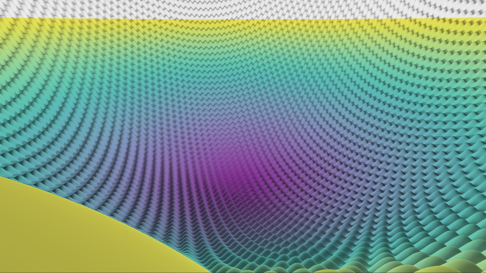
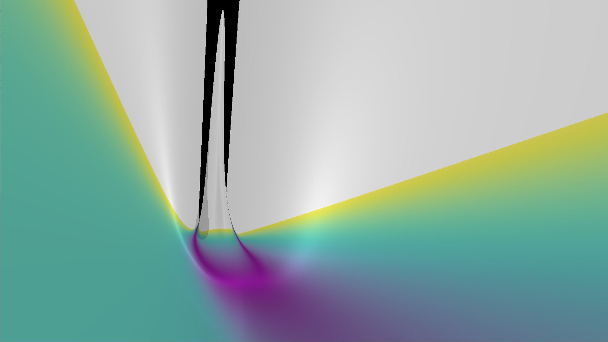

# Function Swim

[WORK IN PROGRESS]

little tool to visualize in 3D optimization functions with GLSL 

## Roadmap:
- Better algorithm for RayMarching in order to render correctly high frequency opt. functions. (Probably gradient based)
- Orthographic projection
- render function points in the scene
- bind population based optimization algorithms rendering the population over the optimizatin process
- better shadows

## Requirements:
- python < 3.8
- moderngl-window
- numpy

## Run:
```bash
python main.py
```

## Pics

#### Rastrigin



#### Rosenbrock


